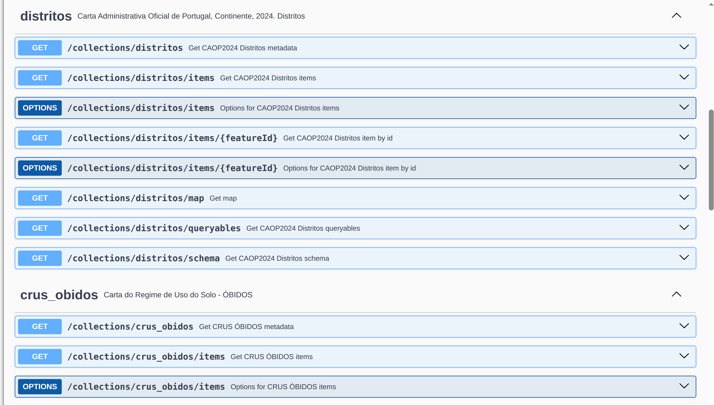
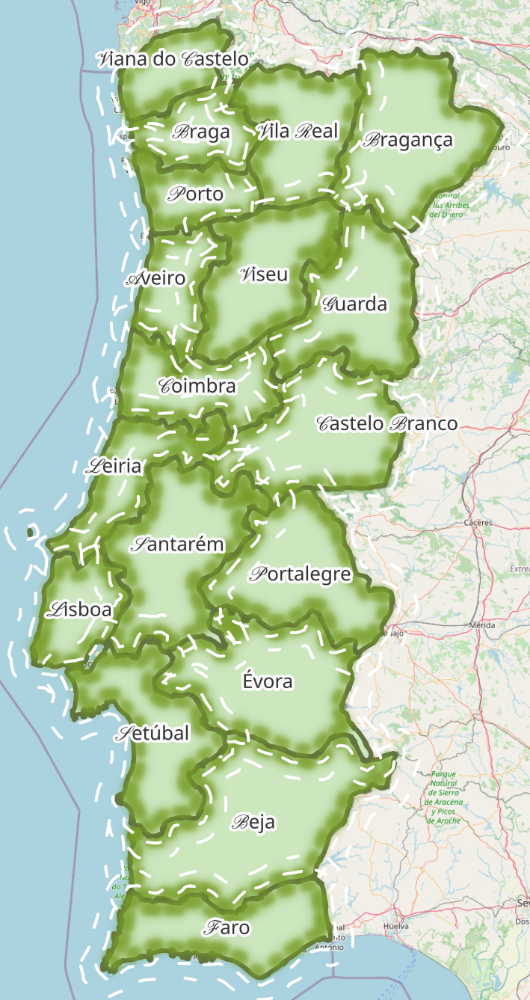
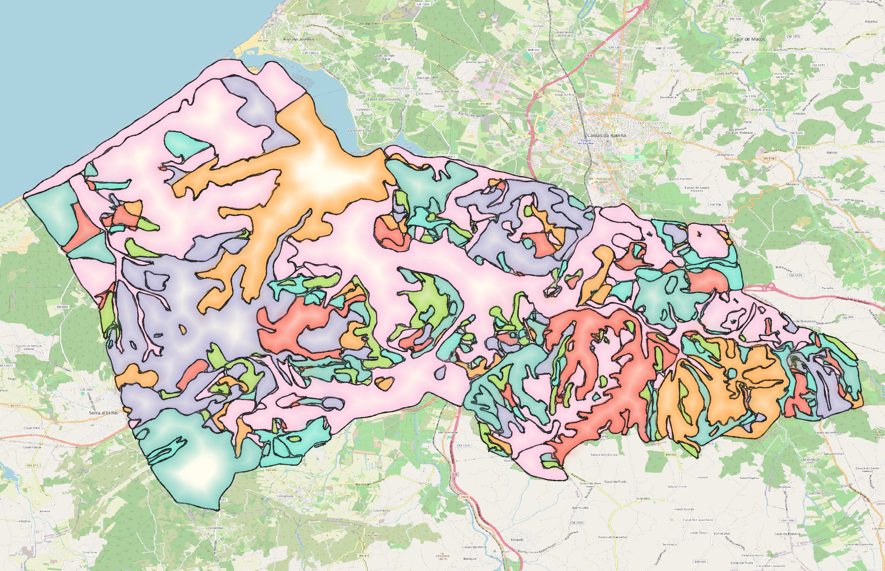

# README

Este repositório apresenta um exemplo simples de publicação de dados vetoriais e raster usando a pygeoapi. [pygeoapi](https://pygeoapi.io/) é uma implementação de servidor Python da suíte de Standards OGC API.



## Setup Rápido

Para executar este exemplo, é necessário ter o `docker` e `docker-compose` instalados no sistema. 
[Esta página](https://dive.pygeoapi.io/setup/) apresenta instruções para instalar o docker (em inglês). Também é necessário acesso a um terminal e a um editor de texto.

## Iniciar a pygeoapi

Abrir um terminal na raiz deste repositório e executar:

```bash
docker compose up
```

Ou se quiser correr o processo no background:

```bash
docker compose up -d
```

## Configuração

A configuração do serviço `pygeoapi` está descrita nos ficheiros [./docker-compose.yml](./docker-compose.yml) e [./docker.config.yml](./docker.config.yml).

As variáveis de ambiente, devem ser configuradas num ficheiro `.env` na raiz desta directoria. Exemplo:

```
POSTGRES_USER=postgres
POSTGRES_PASSWORD=mypassword
POSTGRES_DB=postgres
```

## Dados

Os conjuntos de dados usados neste exemplo são a [Carta Administrativa Oficial de Portugal - CAOP2024 (Continente) - Distritos](https://snig.dgterritorio.gov.pt/rndg/srv/por/catalog.search#/metadata/198497815bf647ecaa990c34c42e932e) e a [Carta do Regime de Uso do Solo - ÓBIDOS](https://snig.dgterritorio.gov.pt/rndg/srv/por/catalog.search#/metadata/517c5023-04cc-47a4-99f7-bb32814dd62f); estão armazenados na directoria [./data]([./data]) em formato geopackage e BD (dump de PostGIS).

<!-- As tiles vetoriais contidas em [./data/tiles/](./data/tiles) foram geradas com o seguinte comando (a partir da raiz desta directoria):
/
```bash
docker run -it --rm -v $(pwd)/data:/data emotionalcities/tippecanoe \
tippecanoe -r1 -pk -pf --output-to-directory=/data/tiles/ --force --maximum-zoom=11 \
--extend-zooms-if-still-dropping --no-tile-compression /data/cont_distritos.geojson
``` -->
<!--  -->

<table>
    <tr>
        <td></td>
        <td></td>
    </tr>
</table>

## License

Este projecto está publicado com uma licença [MIT License](./LICENSE)

[](https://opensource.org/licenses/MIT)